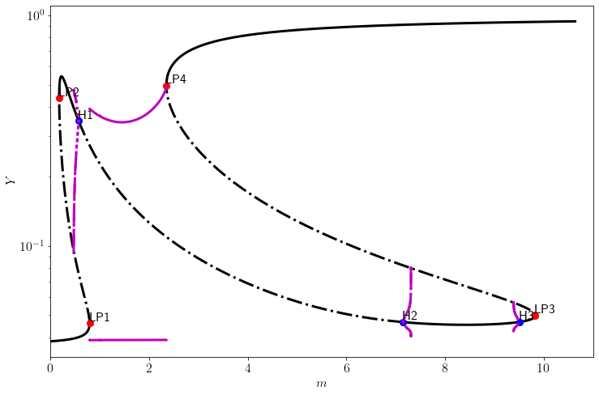
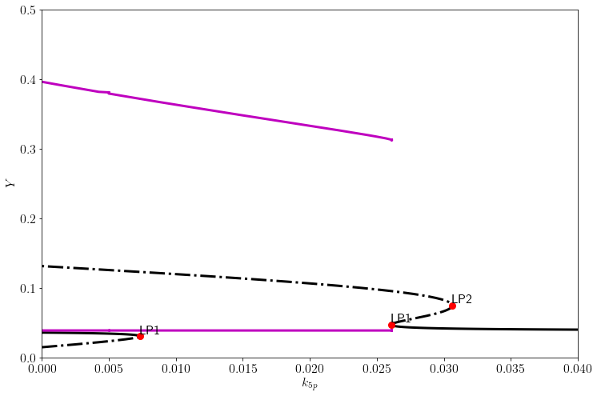
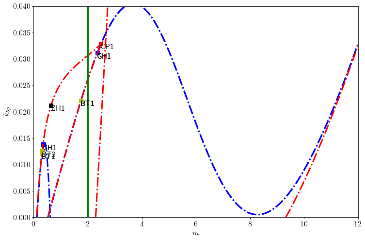

# Carryover of a saddle-node bifurcation

The carryover of a bifurcation is a concept in which a bifurcation in a system is preserved after we transfor one parameter into a variable. More precisely, consider a -dimentional system with two parameters

and assume that this system has a saddle-node as one of the parameters crosses the bifurcation point. Now consider transforming , not necesarilly the 
bifurcation parameter, into a variable to obtain an extended system

A saddle-node bifurcation in the extended system that has originated from the original saddle-node bifucation is called the carryover of the latter.

The study of a carryover can be done via a two-parameter bifurcation diagram in the original system: if the nullcline of the new equation ( intersects transversally the two-parameter bifurcation curve in the -plane and the tangent line is not parallel to the -axis at the intersction, then the extended system has a saddle-node bifurcation at the inersection as  varies. See more details in the [manuscript (draft)](article.pdf). For illustrative examples see the Python notebooks below.

The main idea is that a saddle-node bifurcation in an original system, such as that labeled `LP1` below,

appears in the extended system, the one on the right labeled `LP1` below,

by simply using the two-parameter bifurcation diagram of the original system and the nullcline of the new equation (coloured green below).

The first bifurcation diagram was produced using $k_{5p}=0.005$, so all the points in this bifuraction diagram can be identified in the two-parameter bifurcation diagram (thrid figure) by the colour. The saddle-node bifurcation in the extended system occurs at the intersection of the green vertical line (nullcline for $\mu_1$) and red dashed-dotted lines (continuation of the saddle-node bifurcations in the original system). They correspond to the two saddle-node bifurcation points to the right in the second bifurcation diagram. 

The saddle-node bifurcation point labeled `LP1` in the first bifurcation diagram is associated with a limit cycle (purple curves indicate the minimum and maximum values of the cycle), thus the bifurcation point is actually a saddle-node in an invariant circle (SNIC) bifurcation point. The carryover of this SNIC bifurcation point is also a SNIC in the extended system. The saddle-node bifurcation labled `LP1` to the left in the second bifurcation diagram is not the carryover of any bifurcation curve in the two-parameter bifurcation curve. 

There are two conditions that need to be satisfied for the carryover of a saddle-node bifurcation: a) the nullcline of the new equation in the extended system (green curve) intersect transversally the saddle-node bifurcation curve, and b) the tangent line nullcline at the intersection is not parallel to the axis of the transformed variable ($\mu_1$-axis in this case). All saddle-node bifurcations in the two-parameter bifurcation diagram can be carried-over as long as the new nullcline satisfies those conditions.

### Notebooks with examples and applications:

- [Toy examples](/notebooks/Carryover%20notebook.ipynb)

- [Gen activation](/notebooks/Application%20Gen%20activation.ipynb)

- [Cell cycle progression](/notebooks/Application%20Cell%20cycle.ipynb) [(full diagrams)](/notebooks/Application%20Cell%20cycle%20full%20diagram.ipynb)

- [Diabetes model](/notebooks/Application%20Pathway%20to%20diabetes.ipynb)
